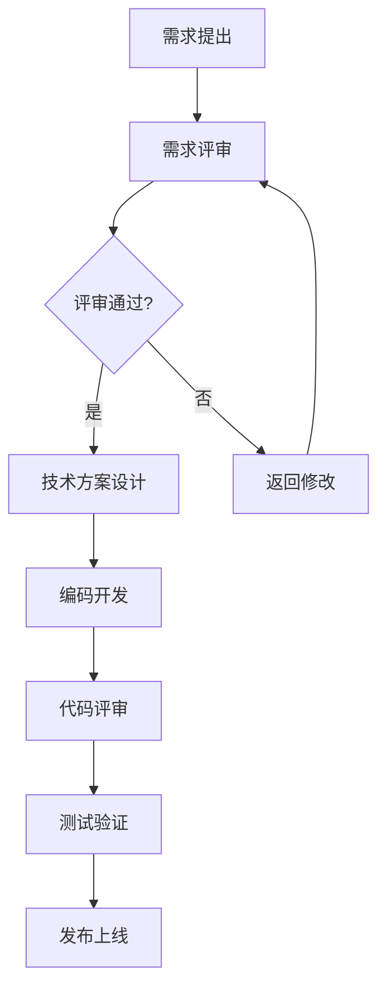

# 关于

Workflow Show — 岗位工作内容、流程与文件展示平台。

## 项目说明

本网站用于可视化展示岗位的工作职责、业务流程及相关的规范文件，帮助团队成员快速了解工作全貌。

## 主要功能

- **思维导图**：以交互式脑图展示各岗位工作内容及流程节点
- **流程图**：支持 Mermaid 流程图、时序图等图表渲染
- **文件下载**：提供规范文档、模板文件的集中下载

## 流程图示例

## 技术栈

- 基于 [VitePress](https://vitepress.dev) 构建
- 使用 [markmap](https://markmap.js.org) 渲染思维导图
- 使用 [Mermaid](https://mermaid.js.org) 渲染流程图
- Docker 容器化部署

## 项目仓库

源码托管于 GitHub，欢迎提交 Issue 和 Pull Request。
